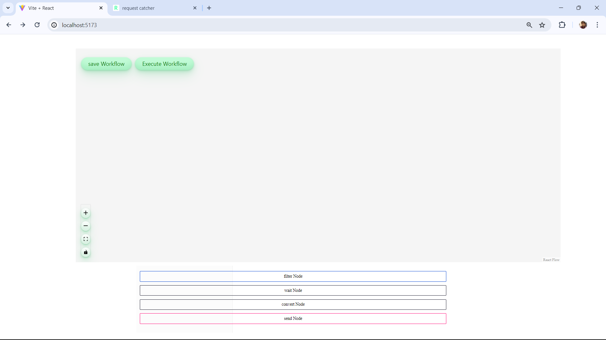
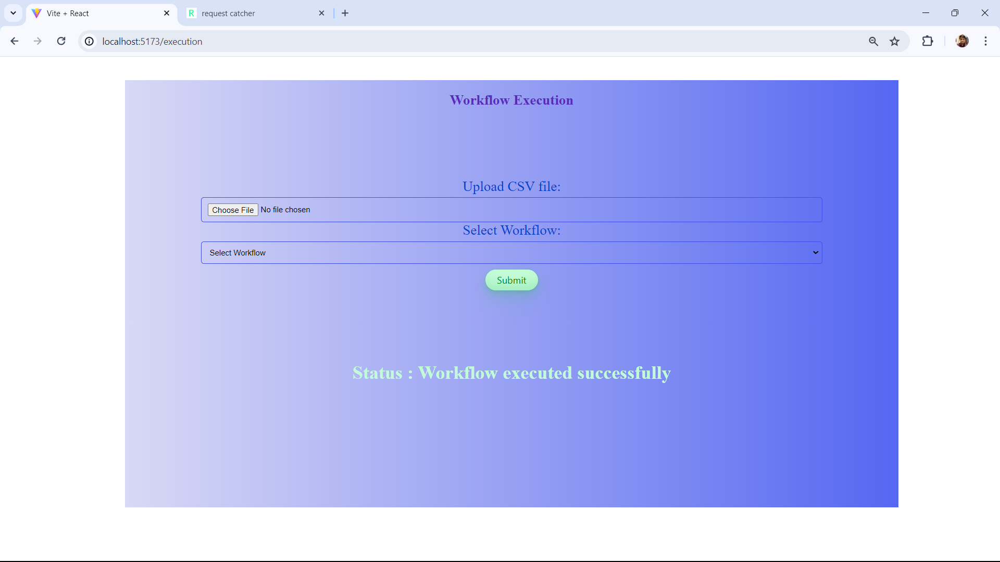

MyApp
Description

Features
Task Management: Organize your tasks into customizable categories and prioritize them based on importance.
Workflow Execution: Upload workflow data consisting of node types and connections, and MyApp's backend interprets the workflow to execute tasks in the defined sequence.
Filter Data Node: The "Filter Data" node processes uploaded data by converting column values to lowercase.
Wait Node: Introduces an asynchronous delay using server-side logic to synchronize task execution.
Convert Format Node: Transforms data from CSV to JSON format for compatibility and ease of use.
Send POST Request Node: Transmits the generated JSON payload to a predefined URL (a mock URL using https://requestcatcher.com/ can be used for testing).

Screenshots

Contributing
We welcome contributions from the community to make MyApp even better! If you have any suggestions, bug reports, or feature requests, please submit them via GitHub issues.

License
MyApp is licensed under the MIT License. See the LICENSE file for more details.